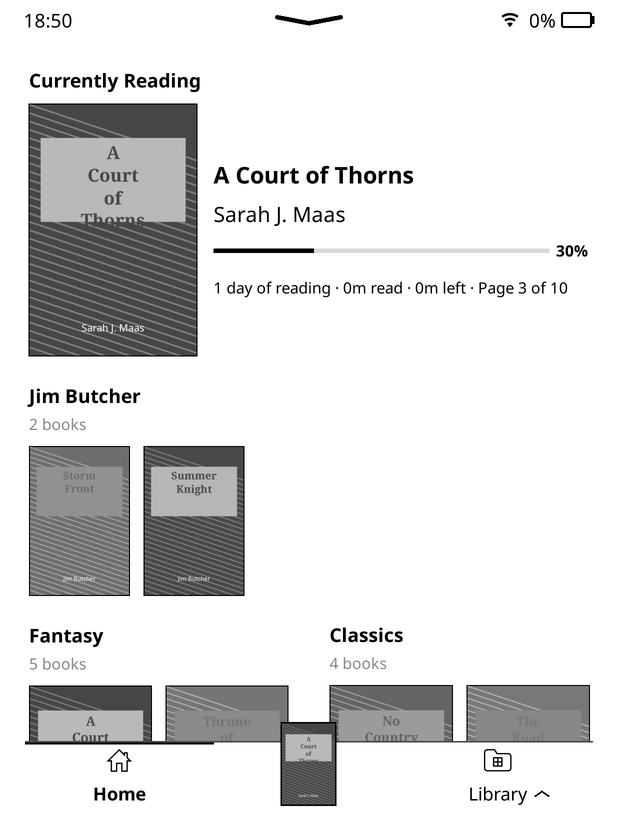
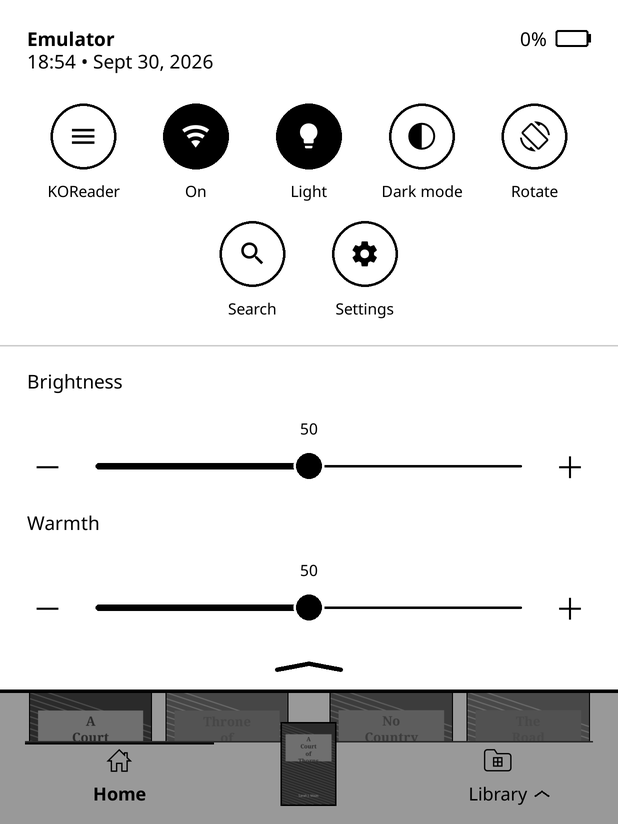
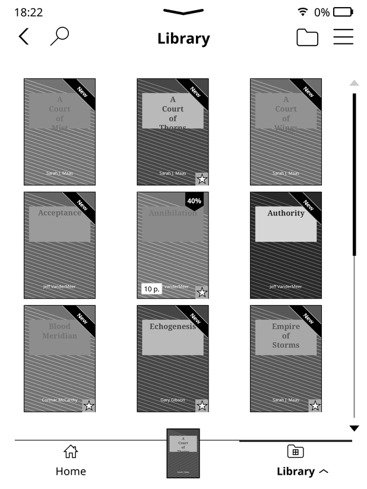
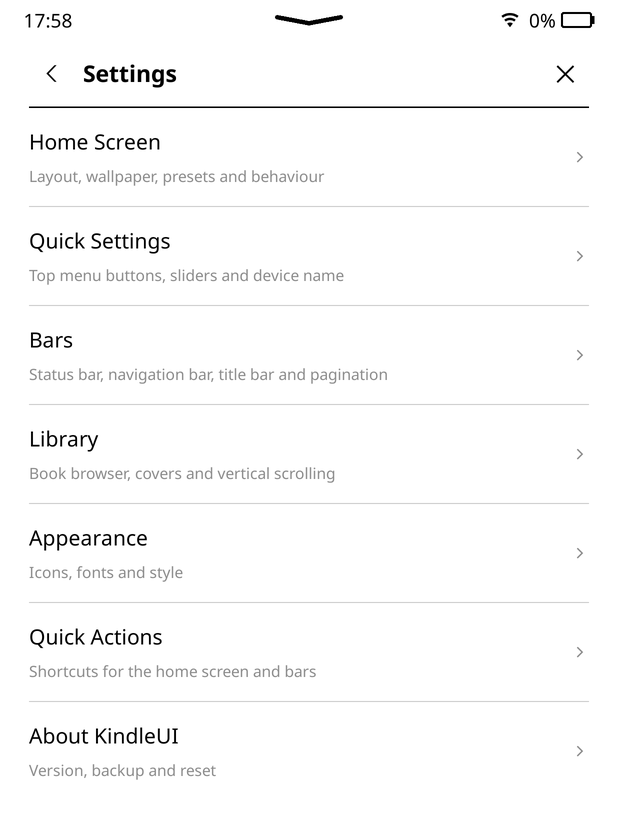
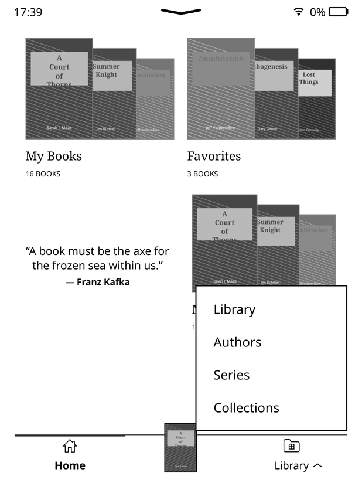

# KindleUI

**A KindleOS-style interface for [KOReader](https://github.com/koreader/koreader).**
A Home screen with modules, a bottom navigation bar with the book you're reading, a Kindle-like
quick-settings panel as the top menu, Kindle-style settings pages and a vertically scrolling library.

Made for jailbroken Kindles, and works on any device KOReader runs on.

  
  
  
  
  

*Screenshots are from the KOReader emulator with sample books.*

---

## Features

- **Home screen** with modules you arrange yourself, over several pages:
  - Currently Reading, Recent, To Be Read, Featured Collection, Author / Series Collection;
  - Two Columns, which puts any two modules side by side;
  - Quote of the Day, Clock, Reading Goals, Reading Stats, Reading Heatmap, Quick Actions and more.
- **Navigation bar** at the bottom:
  - a **Current Book** tab whose cover rises above the bar, like on KindleOS;
  - **groups** that open a Kindle-style menu (e.g. `Library ^` → Library, Authors, Series, Collections).
- **Quick settings** as the only top menu:
  - device name, time, date and battery;
  - round buttons;
  - brightness and warmth sliders (warmth uses the Kindle's own 0–24 scale).
  - A **KOReader** button opens KOReader's full menu.
- **Kindle-style settings**: full-screen pages, switches and chevrons.
- **Library**:
  - vertical scrolling with a KindleOS-style scrollbar;
  - browsing by author and series;
  - folder covers.
- **KindleOS touches**:
  - no "Opening file…" / "Closing book…" popups: the page stays on screen until the book is ready;
  - the flat chevron in the top bar;
  - the horizontal battery;
  - thin black progress bars;
  - book counts under collection titles.

## Requirements

- KOReader (tested with v2026.07). KindleUI is a plugin; nothing in KOReader itself is changed.
- Works best on a touch screen.

## Install

1. Download this repository: **Code → Download ZIP**, or a release.
2. Unzip it. The folder **must be named `KindleUI.koplugin`**; GitHub's ZIP names it `KindleUI.koplugin-main`, so rename it.
3. Copy the folder into KOReader's `plugins/` folder. On a Kindle that is usually `koreader/plugins/`.
4. If you use **SimpleUI** or **vertical_library_scroll**, remove them or leave them disabled. KindleUI replaces both; if they're still enabled it switches them off and asks you to restart.
5. Restart KOReader.

Coming from SimpleUI? Your Home screen, modules and bars carry over, because KindleUI reads the same settings.

## Getting started

- **Settings:** KOReader menu → Tools → **KindleUI**, the **Settings** button in quick settings, or a long press on a module or bar.
- **Quick settings:** tap or swipe down at the top of the screen. The **KOReader** button in it opens KOReader's normal menu.
- **Home screen layout:** Settings → Home Screen → **Edit Home Screen Layout** → Add Module.

---

## Quick settings (the top menu)

Tapping or swiping down at the top of the screen (Home, Library or while reading) opens the quick-settings panel, laid out like KindleOS:

- **Header.** The device name, the time and date ("18:07 • Sept 30, 2026") and the battery.
- **Buttons.** Round buttons with a label under each, filled when on, in equal columns; a shorter last row is centred.
- **Wi-Fi button.** Its label shows the network's name when connected, "On" when on but not connected, and "Off".
- **Sliders.** Brightness and Warmth, with the value above the knob and − / + on each side. Warmth uses the device's own scale, so on a Kindle it goes from 0 to 24, like KindleOS.
- **Closing.** Tap the up chevron, tap below the panel, or swipe up. The screen behind is dimmed.

Long-press a button to open its settings. The **KOReader** button is always there. You can rename it and change its icon, but it can't be hidden and its action can't change.

**Settings → Quick Settings** (also under Bars). Everything saves as soon as you change it.

- **Top menu shows quick settings only.** Switch it off to get KOReader's normal menu back.
- **Device name.** Read from the Kindle when possible; otherwise type your own.
- **Buttons.**
  - Add a custom button.
  - Arrange buttons.
  - Buttons per row (3–8).
  - Each button has *Show in quick settings*, *Name* and *Icon*. Custom buttons also have *Action* (any KindleUI or KOReader action) and *Delete*.
  - **Capture mode.** *Add a button from KOReader's menu*, or *Action → Pick from KOReader's menu (capture)*, opens KOReader's own menu. Go to any item, even one without a gesture action (a plugin entry, a setting…), and tap it: instead of running, it becomes the button's action. Closing the menu cancels.
  - Built in: KOReader, Wi-Fi, Light, Dark mode, Rotate, Sleep, Screenshot, Search, Home, Library, Settings, Restart, Exit.
- **Slider options.** Brightness slider, warmth slider (on devices with warm light), − / + buttons.
- **Dim the screen behind the panel.**

**Icon picker.** Every symbol in KOReader's icon font, common ones first, searchable. It includes a KindleOS-style half circle for dark mode. You can also pick images.

**Gesture actions.** "KindleUI: Quick settings" and "KindleUI: KOReader menu".

## Home screen modules

Add modules from **Settings → Home Screen → Edit Home Screen Layout → Add Module**. Long-press a module on the Home screen to change its settings.

- **Currently Reading.** The cover, title, author, progress bar and reading stats.
  - *Show cover* can be switched off for a text-only card.
  - *Page progress* adds "Page 3 of 10".
- **Featured Collection.** Covers from one collection, with the number of books under its title.
- **Author / Series Collection.** Like a Featured Collection, but it shows one author or series from your library and shuffles to another each time you come back to Home ("Ali Hazelwood", then "A Court of Thorns and Roses"…).
  - Choose authors and/or series, the minimum number of books, and how often to shuffle (every visit, hourly, daily).
- **Two Columns.** Puts two modules side by side.
  - Pick the left and right module, or create a new collection just for that column.
  - Set the left column's width.
  - Rows of covers always show one row of two books in a column. Swipe them, or use the ‹ 1/3 › arrows next to their title, to see the rest.
  - The Clock can't go in a column; use its Column Width setting instead.
- **Reading Calendar.** This month as a calendar filling a page, like KOReader's statistics Calendar view: the books you read each day as grey bars with their titles (one bar across consecutive days), the time read per day, and today highlighted. Use ‹ › next to the title to go back through earlier months (› is greyed out on the current month); it opens on the current month every time you go Home. Tap the calendar to open KOReader's full Calendar view. Settings: *Height* (100% fills the page, so give it a page of its own), *Week starts on* (Monday or Sunday), *Show reading time per day*, section label. It needs the Reading statistics plugin.
- **And more:** Recent, To Be Read, New Books, Cover Deck, Collections, Quote of the Day, Clock, Reading Goals, Reading Stats, Reading Heatmap, Quick Actions, Action List and Spacer.

Progress bars in modules are thin and black. Collection titles show their book count on a smaller second line.

## Navigation bar

Settings → Bars → **Navigation Bar**: tabs, tab style (icons, text or both), sizes and more.

The bar is slim by default, like KindleOS's. Its height, icons and labels can all be resized there.

Its height follows the tab style:

- **Text only:** a compact bar that just fits the labels, like KindleOS with icons turned off.
- **Icons and text:** a little taller, with some space above the icons.
- **Icons only:** the standard height.

Changing the style redraws the Home screen to fit straight away.

### Current Book tab

Shows the cover of the book you're reading, rising above the bar like on KindleOS. Tap it to open the book.

### Groups

One tab can hold several actions and open a Kindle-style menu above itself. For example:
`Home   [Current Book]   Library ^`, where **Library** opens Library, Authors, Series and Collections.

1. Settings → Quick Actions → Custom Quick Actions → **Create Quick Action**.
2. Choose **Group of Quick Actions** and tick the actions, in order. Give it a name (e.g. "Library") and, if you like, an icon.
3. Settings → Bars → Navigation Bar → **Tabs** → Add Item → your group.

With text labels on, the group's name gets a small up chevron. The group's tab stays highlighted while you're in any of its places.

## Library

- **Vertical scrolling library** (Settings → Library). Swipe up or down to turn pages.
  - A KindleOS-style scrollbar sits on the right: a triangle at each end (grey when you can't go further), a thin track, and a black bar for where you are.
- **Browse button** (top right of the Library): *All books*, *Authors*, *Series*, *Collections* or *Tags*.
  - The Library **remembers your choice**. Open a book, go Home, come back with the Library tab: you're back in the same view.
  - Back from the top of Authors/Series/Collections/Tags, or *All books*, goes back to showing all books.
  - Picking Authors, Series or Collections from a navigation bar group is remembered too.
- **Collections view**, drawn like Series: one folder per collection, shown as a stack: the first book's cover with stacked edges, the book count and the name. It follows the Library's list / mosaic mode. Tap a collection to see its books, in the collection's own sort order.
  - Long-press a collection for *Open collection (sort, filter…)* (KOReader's own collection screen), *Manage collections* (create, rename, delete…) and, where it applies, *Set folder cover*.
  - The navigation bar's Collections action opens this view too. It replaces the `2-collections-mosaic.lua` patch.
- **Shuffle sort** for collections: open a collection (long-press → *Open collection*), tap the menu icon → *Sort by* → **Shuffle**. Its books get a new random order every time Home opens (so Featured Collection shows different covers), every time you open the collection, and when you tap Shuffle again. Any other sort method turns it off. It replaces the `2-collection-shuffle.lua` patch.
- **Group series in All books.** Turn it on in the browse button (*Group series in All books*) or under Settings → Library → *Group Series in All Books*. The books of a series become one stack among your other books, like on a Kindle, sorted with the sort method you chose: by title a series sorts under its series name, by date under its most recent book. A series with a single book stays a plain book.
- **Authors sorted by last name** ("Hazelwood", "Le Guin", "Maas"…) but shown as "First Last". "Herbert, Frank" is shown as "Frank Herbert". Switch it off under Settings → Library → *Sort Authors by Last Name*.
- **Browse by author and series**, folder covers, series grouping and more (from SimpleUI).
- Author and series views don't show the "Page x of y" line at the bottom, so it can't sit behind the Current Book cover.

## Opening and closing books

KindleUI hides KOReader's "Opening file…" popup and the "Closing book…" notice. The current page just stays on screen until the book has opened or closed, like on a Kindle. Error messages still show.

To get the popups back, switch off Settings → Behaviour → **Hide Opening / Closing Popups**. The *Closing Book Notice* option then works again.

If you used the separate `2-no-open-close-popup.lua` patch, you can delete it.

## Status bar

The top bar shows the time, Wi-Fi and a horizontal KindleOS-style battery. Status Bar → "Kindle-style battery" switches back to the classic icon.

On the Home screen and in the Library, a flat Kindle-style chevron in the middle means you can swipe down for quick settings.

---

## FAQ

**The plugin doesn't show up.**
The folder must be named exactly `KindleUI.koplugin` and sit directly inside `plugins/`.

**Can I still use KOReader's normal top menu?**
Yes: use the **KOReader** button in quick settings, or switch off *Top menu shows quick settings only*.

**Where are my settings stored?**
In KOReader's `settings/` folder:
- `simpleui/sui_settings.lua` for the Home screen, bars and modules;
- `kindleui_quicksettings.lua` for the quick-settings panel.

Settings → About KindleUI has backup and reset.

**Does it update itself?**
No. Download new versions from this repository.

## For developers

KindleUI started from SimpleUI. The main additions:

| Path | What it is |
| --- | --- |
| `features/quickpanel/` | The quick-settings panel: panel, sliders, buttons, settings pages, icon picker, device name. |
| `features/kui_topmenu.lua` | Makes the panel the top menu. |
| `features/kui_vertical_scroll.lua` | Vertical library scrolling and the scrollbar. |
| `features/kui_book_notices.lua` | Hides the opening / closing book popups. |
| `features/library/kui_author_names.lua` | Author last-name sort keys and "First Last" display. |
| `features/library/kui_collections_view.lua` | Collections as a Library browse view. |
| `features/library/kui_collection_shuffle.lua` | The Shuffle sort method for collections. |
| `screens/kui_navbar_dropdown.lua` | The group menu on the navigation bar. |
| `modules/module_two_col.lua` | Two Columns. |
| `modules/module_meta_row.lua` | Author / Series Collection. |
| `modules/module_calendar.lua` | Reading Calendar. |
| `engines/kui_kobo_tiles.lua` | Shared shuffle logic (and the older Kobo-style shelves). |
| `infra/kui_chevron.lua`, `infra/kui_battery.lua` | The chevron and the horizontal battery. |

SimpleUI's self-updater is disabled so it can't install SimpleUI over KindleUI.

## Credits

- **[SimpleUI](https://github.com/doctorhetfield-cmd)** by doctorhetfield-cmd. KindleUI is built on it: the Home screen, modules, bars, library features and settings window (MIT).
- The quick-settings panel was inspired by the idea of **Neo QuickSettings**. KindleUI's panel is its own code.
- Icon font: Nerd Fonts Symbols, bundled with KOReader.
- **KOReader** and its contributors.

Kindle and KindleOS are trademarks of Amazon; Kobo is a trademark of Rakuten Kobo. KindleUI is an independent project and isn't affiliated with Amazon, Rakuten Kobo or KOReader.

## License

[MIT](LICENSE). The SimpleUI copyright notice is kept, as its license requires.
